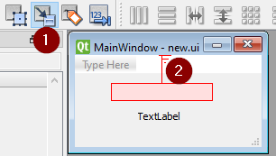
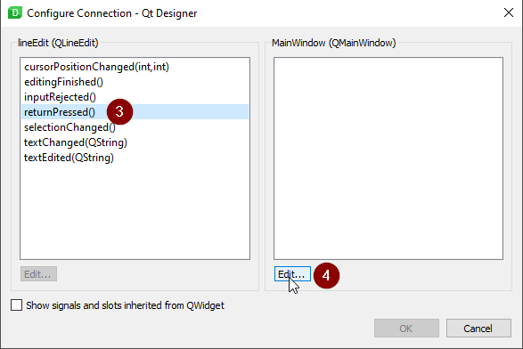
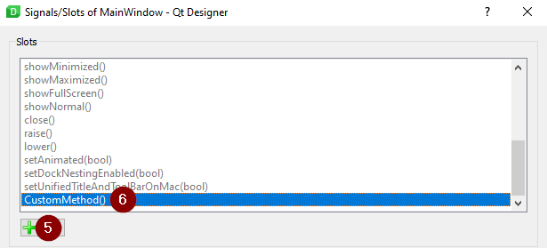

lib - PyQt5 (GUI)
=================
Qt framework is a very powerful cross-platform GUI builder. It is written in C++ and it was ported,
over to python as pyqt. The python documentation is nearly non-existent since it would sort of be
a duplicate of the Qt C++ docs (`PyQt4 if PyQt5 data is missing <https://www.riverbankcomputing.com/static/Docs/PyQt4/modules.html>`_, `PyQt5 <https://doc.bccnsoft.com/docs/PyQt5/>`_ and `Qt <https://doc.qt.io/qt-5/modules-cpp.html>`_).
This package has a very steep learning curve, so take it slow and try to get used to reading the C++ docs.

Installation
------------
Note if you get a ``Could not find a version that satisfies the requirements`` during a pip install,
then your current python version is not supported by pyqt.

.. code-block:: shell

    pip install pyqt5 pyqt5-tools

Designer (GUI builder)
----------------------
PyQt comes with an awesome drag and drop GUI builder ``designer.exe``.
The tool (and all other pyqt .exe) will be placed in:

- lib/site-package/pyqt5_tools/Qt/bin
- or if you are using virtualenv, it will simply be under Scripts

1) Construct your GUI by drag/drop method and save it as a ``.ui``
2) Convert your ``.ui`` to python code with ``pyuic5.exe``

.. code-block:: shell

    # -x to make it executable (creates __name__ == "__main__")
    # -o to specify output filename
    pyuic5.exe -x -o outputfilename.py designerfilename.ui

Designer to Python code setup
-----------------------------
An efficient way to use Qt Designer is export out the widget code then without alterations of your
designer created code we import it into the logic modules. This will save a lot of time when we have to
go back to designer and adjust something or add a new widget. We simply re-export out the python code
and the import takes care of the rest. The following example is a good starter code that handles the
exported ``form.py`` designer exported python code.

- QtWidgets: App > MainWindow > all widgets `QtWidgets <https://doc.qt.io/qt-5/qtwidgets-module.html>`_
- QtCore: brains of qt `QtCore <https://doc.qt.io/qt-5/qtcore-module.html>`_

    - Qt: misc qt library items(ex: keys, mouse) `Qt <https://doc.qt.io/qt-5/qt.html>`_

        - Keys: `QKey <https://doc.qt.io/qt-5/qt.html#Key-enum>`_
        - Mouse Keys: `QMouseButton <https://doc.qt.io/qt-5/qt.html#MouseButton-enum>`_

    - QPoint: hold point properties (ex: position) `Qpoint <https://doc.qt.io/qt-5/qpoint.html>`_
    - QEvent: all event types, but not sensor (ex: KeyPress) `QEvent <https://doc.qt.io/qt-5/qevent.html>`_

- QtGui: event sensors and graphical editor (ex: colors, fonts etc) `QGui <https://doc.qt.io/qt-5/qtgui-module.html>`_

.. code-block:: python

    # form.py is the designer exported python code
    from form import Ui_MainWindow
    # QtWidgets is the collection of all Qt windows (QApplication > QMainWindow > widgets, events)
    # QtCore is the collection of keyboard/mouse/event types
    # QtGui is the collection of event sensors and graphical editors like color/font
    from PyQt5 import QtWidgets, QtCore, QtGui
    # sys is call to handle any arguments passed in from the terminal (optional)
    import sys

    class Ui(QtWidgets.QMainWindow, Ui_MainWindow):
        def __init__(self, *args, **kwargs):
            # initializes QMainWindow object (so that we can call: MainWindow.attribute)
            QtWidgets.QMainWindow.__init__(self, *args, **kwargs)
            # sets up the Designer widgets that we imported
            self.setupUi(self)

            # to enable event handling (if this not stated python will garbage collect all events)
            self.installEventFilter(self)

        # overwrite the Qt event filtering method
        #   (by default it is empty so we edit it to handle key presses
        def eventFilter(self, source, event):
            # lets see how we setup a custom key event
            if (event.type() == QtCore.QEvent.KeyPress and
                    event.key() == QtCore.Qt.Key_A):
                print('you presses the "A" key')

            # first check if a key was pressed, then check if that event matches ctrl+c
            #  which is already built into qt as QKeySequence.Copy
            if (event.type() == QtCore.QEvent.KeyPress and
                    event.matches(QtGui.QKeySequence.Copy)):
                # now pipe the event to any method to logic handling
                self.customcopy()

            # this is to overwrite the existing event filter method
            return super(Ui, self).eventFilter(source, event)

        # our custom method to handle what happens when we hit ctrl+c
        def customcopy(self):
            print("you hit ctrl+c")

    if __name__ == "__main__":
        # create an instance of Qt (pass in sys.argv allows args to be passed it from terminal)
        app = QtWidgets.QApplication(sys.argv)
        # initialize the MainWindow
        gui = Ui()
        # shown the MainWindow
        gui.show()
        # app.exce_() runs the mainloop, and returns 0 for no error, 1 for error
        sys.exit(app.exec_())

Events
------

- paintEvent

- resizeEvent

- keyPressEvent and keyReleaseEvent

- contextMenuEvent

- mouseMoveEvent and mouseReleaseEvent and mouseDoubleClickEvent

Using Builtin Signals
---------------------
Qt widgets already come with a ton of handy signals already coded up that handle events for you. See the
Custom Signal/Connect/Emit Setup section to get a in depth walkthrough on how a signal works but in short,
a signal is already hocked up event handler for a widget action (like the press of a button). You only
have to connect up what happens when a specific signal is emitted (an event happens like pressing a button)
and the rest is taken care of for you (for builtin signals). Lets see how to hock up a builtin signal from
``QLineEdit`` text filed to a ``QLabel`` text when the "Enter" is pressed from the ``QLineEdit`` widget:

.. code-block:: python
    :emphasize-lines: 28,29,36-40

    from PyQt5 import QtCore, QtGui, QtWidgets

    class Ui_MainWindow(object):
        def setupUi(self, MainWindow):
            MainWindow.setObjectName("MainWindow")
            MainWindow.resize(207, 102)
            self.centralwidget = QtWidgets.QWidget(MainWindow)
            self.centralwidget.setObjectName("centralwidget")
            self.lineEdit = QtWidgets.QLineEdit(self.centralwidget)
            self.lineEdit.setGeometry(QtCore.QRect(40, 10, 113, 20))
            self.lineEdit.setObjectName("lineEdit")
            self.label = QtWidgets.QLabel(self.centralwidget)
            self.label.setGeometry(QtCore.QRect(70, 40, 47, 13))
            self.label.setObjectName("label")
            MainWindow.setCentralWidget(self.centralwidget)
            self.menubar = QtWidgets.QMenuBar(MainWindow)
            self.menubar.setGeometry(QtCore.QRect(0, 0, 207, 21))
            self.menubar.setObjectName("menubar")
            MainWindow.setMenuBar(self.menubar)
            self.statusbar = QtWidgets.QStatusBar(MainWindow)
            self.statusbar.setObjectName("statusbar")
            MainWindow.setStatusBar(self.statusbar)

            self.retranslateUi(MainWindow)
            QtCore.QMetaObject.connectSlotsByName(MainWindow)

            # setup the connection from our QLineEdit widget to our method
            self.lineEdit.returnPressed.connect(self.CustomMethod)

        def retranslateUi(self, MainWindow):
            _translate = QtCore.QCoreApplication.translate
            MainWindow.setWindowTitle(_translate("MainWindow", "MainWindow"))
            self.label.setText(_translate("MainWindow", "TextLabel"))

        # our custom method
        def CustomMethod(self):
            # grab the text from the text field
            text = self.lineEdit.text()
            self.label.setText(text)

    if __name__ == "__main__":
        import sys
        app = QtWidgets.QApplication(sys.argv)
        MainWindow = QtWidgets.QMainWindow()
        ui = Ui_MainWindow()
        ui.setupUi(MainWindow)
        MainWindow.show()
        sys.exit(app.exec_())

We can also have Qt Design create the ``self.lineEdit.returnPressed.connect()`` line for us but it doesn't
really save much time. Note that we will have to replace the method name since pyqt Designer does not
allow us to type ``self.Here are the steps:

    :scale: 100%
    :align: center

    :scale: 100%
    :align: center

    :scale: 100%
    :align: center

Custom Signal/Connect/Emit Setup
--------------------------------
Signals are a great way to jump in and out of function when a certain event or condition was satisfied.
As with any problem, this what a signal does can also be achieved without ever using signals but signals
can make more of a logical sense. There are 4 pieces to a signal setup/use:

1) Signal: Class Attribute; Defines the signal name, and sets up argument types (types must be setup)

2) Define Slot: Class Method; Defines the method that is called when a signal is emitted

3) Connect: Inside __init__; Connects the Signal Class Attribute to the Class Method

4) Emit: A Call; Emit a signal

.. code-block:: python

    # form.py is the designer exported python code
    from form import Ui_MainWindow
    from PyQt5 import QtWidgets, QtCore, QtGui
    import sys

    class Ui(QtWidgets.QMainWindow, Ui_MainWindow):
        # STEP 1: Define a "SIGNAL", and define the type or argument that is being passed
        #  in this example: we can pass a bool and str argument when a emit occurs
        a_key_pressed = QtCore.pyqtSignal(bool,str)

        def __init__(self, *args, **kwargs):
            QtWidgets.QMainWindow.__init__(self, *args, **kwargs)
            self.setupUi(self)
            self.installEventFilter(self)

            # STEP 3: "CONNECT" a signal to a "SLOT"
            a_key_pressed.connect(self.slot_a_key_pressed)

        # overwrite the Qt event filtering method
        #   (by default it is empty so we edit it to handle key presses
        def eventFilter(self, source, event):
            # lets see how we setup a custom key event
            if (event.type() == QtCore.QEvent.KeyPress and
                    event.key() == QtCore.Qt.Key_A):
                print('you presses the "A" key')
                # STEP 4: "EMIT" the signal in practice
                a_key_pressed.emit(True,"emitted signal A")

        # STEP 2: define a "SLOT" that handle what happens when the signal is emitted
        def slot_a_key_pressed(self,arg1,arg2):
            print(f"It is {arg1} that we {arg2}")

     if __name__ == "__main__":
        # create an instance of Qt (pass in sys.argv allows args to be passed it from terminal)
        app = QtWidgets.QApplication(sys.argv)
        # initialize the MainWindow
        gui = Ui()
        # shown the MainWindow
        gui.show()
        # app.exce_() runs the mainloop, and returns 0 for no error, 1 for error
        sys.exit(app.exec_())

Path File Browser
-----------------
There are several file/folder browser dialogs available to the user:

- ``QFileDialog.getExistingDirectory(self, title, path, filter)`` where filter: "Images (*.png *.jpg);; Text(.txt)"

.. code-block:: python

    # NOTE: this is another method to the example shown above under "Designer to Python code setup"

    def getpath(self):
        path = QtWidgets.QFileDialog.getExistingDirectory(self, 'Select Directory')
        return path

- ``QFileDialog.getOpenFileName(self, title, path, filter)`` similar to directory expect this opens the file for streaming
  this can return a returns a list no matter what, if a single file was selected or multiple.

.. code-block:: python

    # NOTE: this is another method to the example shown above under "Designer to Python code setup"
    def openfile(self):
        filename = QtWidgets.QFileDialog.getOpenFileName(self, 'Select File')
        if filename[0]:
            with open(filename[0], 'r') as f:
                data = f.read()

- ``QFileDialog.getSaveFileName(self, title, path, filter)`` similar to file expect this opens the file for streaming

.. code-block:: python

    # NOTE: this is another method to the example shown above under "Designer to Python code setup"
    def openfile(self):
        filename = QtWidgets.QFileDialog.getSaveFileName(self, 'Select File to Save')
        if filename[0]:
            with open(filename[0], 'w') as f:
                f.write(data)

MessageBox Popup
----------------

.. code-block:: python

    # NOTE: this is another method to the example shown above under "Designer to Python code setup"

    # the following is useful as error handling popup
    try:
        # some code
    except Exception as e:
        msgbox = QtWidgets.QErrorMessage(self)
        msgbox.showMessage(str(e))

Common Widgets And A Short Description
--------------------------------------

QLabel
^^^^^^
A un-editable text field has the following methods

- ``setText()`` assign text to the Label
- ``clear()`` clear the text from the Label

QLineEdit
^^^^^^^^^
An editable text field has the following methods

- ``setEchoMode(int)`` possible inputs:

    - 0: Normal, what you type is what you see

    - 1: NoEcho, you cannot see what you type but the text is still stored

    - 2: Password, each character types is instead replaced by "*"

    - 3: PasswordEchoOnEdit,it displays the characters while typing but is then "*" out afterwards

- ``maxLength()`` specify how many characters can be typed into the text field

- ``setText()`` set a default text

- ``text()`` get the text out of the text field

- ``clear()`` clears text field

- ``setReadOnly()`` text field cannot be edited but it can be copied

- ``setEnabled()`` by default = ``True`` but can be passed a ``False`` to disable from edit/copy

- Signals:

    - ``QLineEdit.textChanged.connect(custom_method_pipe)`` when text is changed

    - ``QLineEdit.returnPressed.connect(custom_method_pipe)`` when enter is pressed from textbox

QPushButton
^^^^^^^^^^^
Simple on/off button that emits a signal when clicked, with the following

QTableWidget
^^^^^^^^^^^^

- ``setRowCount()`` redefine how many rows there are in the table (similar for column)

- ``rowCount()`` returns the number of rows in the table (similar for column) note this is not the row
  that contain data, but all rows

- ``clear()`` clears all content from the entire table

- ``setItem(row,col,QtWidgets.QTableWidgeItem(data))`` where row and column are ``int`` and ``data`` is a ``str``

.. code-block:: python

    # NOTE: this is another method to the example shown above under "Designer to Python code setup"

    # set cell value
    def mycellsetter(self, value):
        # input value must be a string
        row = 0
        col = 0
        self.table.setItem(row,col,QtWidgets.QTableWidgetItem(str(value)))

    # to get cell value
    def mycellgetter(self):
        row = 0
        col = 0
        # return values will always be strings
        return self.table.item(row, col).text()

    # to iterate through a tableWidget
    def tableiter(self):
        maxcol = self.table.model().columnCount()
        maxrow = self.table.model().rowCount()
        for c in range(maxcol):
            for r in range(maxrow):
                # note that empty cells show up as None type
                if self.table.item(r,c) != None:
                    # to get the actual value stored we have to call .text() on the current cell
                    self.table.item(r,c).text()

    # to copy from table
    def copySelection(self):
        # note this is tablename specific (table name = "table")
        selection = self.table.selectedIndexes()
        if selection:
            rows = sorted(index.row()) for index in selection)
            columns = sorted(index.column() for index in selection)
            rowcount = rows[-1] - row[0] + 1
            colcount = columns[-1] - columns[0] + 1
            table = [[''] * colcount for _ in range(rowcount)]
            for index in selection:
                row = index.row() - rows[0]
                column = index.coumn() - columns[0]
                table[row][column] = index.data()
            stream = io.StringIO()
            csv.writer(stream, delimiter='\t').writerows(table)
            QtWidgets.qApp.clipboard().setText(stream.getvalue())

    # to paste to table
    def pasteSelection(self):
        # note this is table name specific (table widget name = "table")
        selection = self.table.selectedIndexes()
        model = self.table.model()

        if selection:
            buffer = QtWidgets.qApp.clipboard().text()
            rows = sorted(index.row() for index in selection)
            columns = sorted(index.column() for index in selection)
            reader = csv.reader(io.StringIO(buffer), delimiter='\t')
            if len(rows) == 1 and len(columns) == 1:
                for i, line in enumerate(reader):
                    for j, cell in enumerate(line):
                        model.setData(model.index(row[0] + 1, columns[0] + j), cell)
            else:
                arr = [[cell for cell in row] for row in reader]
                for index in selection:
                    row = index.row() - rows[0]
                    column = index.column() - columns[0]
                    model.setData(model.index(index.row(), index.column()), arr[row][column])

Indexing A QTabWdiget
^^^^^^^^^^^^^^^^^^^^^

.. code-block:: python

    def tabpiper(self):
        if self.yourtabwidgetname.currentIndex() == 0:
            print('you are on the first tab')
        elif self.yourtabwidgetname.currentIndex() == 1:
            print('you are on the second tab')

PyInstaller Packing TroubleShooting
-----------------------------------
Dealing with "ImportError: unable to find QtCore.dll on PATH"

- Run on pyinstaller 3.5 and PyQt5 5.12.3 (`PyInstaller Link <https://pyinstaller.readthedocs.io/en/stable/man/pyi-makespec.html>`_)
- Create spec file via (pyi-makespec filename.py)
- Add to gui.spec datas=[('fullpath/site-packages/PyQt5/Qt/bin/*','PyQt5/Qt/bin')]
  then run pyinstaller gui.spec --onefile

GUI Lockup - Multithreading
---------------------------
Execute multiple tasks without locking up the GUI. Threading has a few parts:

- class initialization and class instance: where we feed information to the thread class, like the GUI window
- class run method and class start(): ``threadname.start()`` calls the ``run`` method from the thread class
- threads join: join all of the threads together

.. code-block:: python

    # Qt Designer Output of 2 progress bars
    from PyQt5 import QtCore, QtGui, QtWidgets

    class Ui_Dialog(object):
        def setupUi(self, Dialog):
            Dialog.setObjectName("Dialog")
            Dialog.resize(400, 300)
            self.progressBar = QtWidgets.QProgressBar(Dialog)
            self.progressBar.setGeometry(QtCore.QRect(130, 80, 118, 23))
            self.progressBar.setProperty("value", 0)
            self.progressBar.setObjectName("progressBar")
            self.progressBar_2 = QtWidgets.QProgressBar(Dialog)
            self.progressBar_2.setGeometry(QtCore.QRect(140, 160, 118, 23))
            self.progressBar_2.setProperty("value", 0)
            self.progressBar_2.setObjectName("progressBar_2")

            self.retranslateUi(Dialog)
            QtCore.QMetaObject.connectSlotsByName(Dialog)

        def retranslateUi(self, Dialog):
            _translate = QtCore.QCoreApplication.translate
            Dialog.setWindowTitle(_translate("Dialog", "Dialog"))

    # our code for threading on 2 progress bars without locking up the GUI
    import sys
    import threading
    import time
    from PyQt5.QtWidgets import QDialog, QApplication

    class GUI(QDialog):
        def __init__(self):
            super().__init__()
            self.ui = Ui_Dialog()
            self.ui.setupUi(self)
            self.show()
    class aThread (threading.Thread):
        counter=0
        def __init__(self, gui, ProgressBar, steps):
            threading.Thread.__init__(self)
            self.gui=gui
            self.counter=0
            self.steps = steps
            self.progreassBar=ProgressBar
        def run(self):
            print ("Starting " + self.name)
            while self.counter <=100:
                time.sleep(0.5)
                self.progreassBar.setValue(self.counter)
                self.counter+=self.steps
            print ("Exiting " + self.name)

    if __name__=="__main__":
        app = QApplication(sys.argv)
        gui = GUI()
        thread1 = aThread(gui, gui.ui.progressBar)
        thread2 = aThread(gui, gui.ui.progressBar_2)
        thread1.start() # to start the thread (calls .run())
        thread2.start() # to start thread2 (calls .run())
        gui.exec()  # this is to keep the gui window responsive
        thread1.join()  # bring back the tread and merge data
        thread2.join()
        sys.exit(app.exec_())